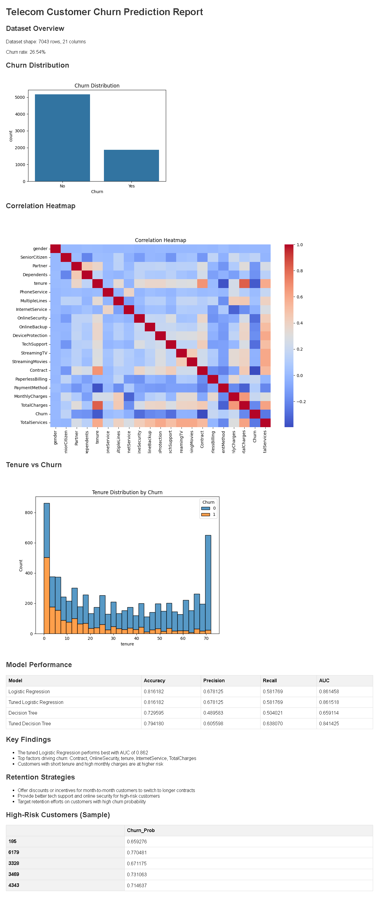

# Telecom Customer Churn Prediction

Predicts customer churn for a telecom company using Logistic Regression and
Decision Tree with GridSearchCV hyperparameter tuning.

## Key Findings
- Dataset: 7,043 customers, 26.54% churn rate
- Tuned Logistic Regression performs best: AUC 0.862
- Top churn drivers: Contract type, OnlineSecurity, tenure, InternetService, TotalCharges
- Customers with short tenure and high monthly charges are at highest risk

## What I Did
- Explored churn distribution, correlation structure, and tenure-vs-churn patterns
- Engineered a TotalServices aggregate feature
- Trained and tuned Logistic Regression and Decision Tree classifiers with GridSearchCV
- Delivered an HTML report with retention strategies and high-risk customer profiles

## Report Preview

## Tools
Python · scikit-learn · pandas · matplotlib · seaborn
